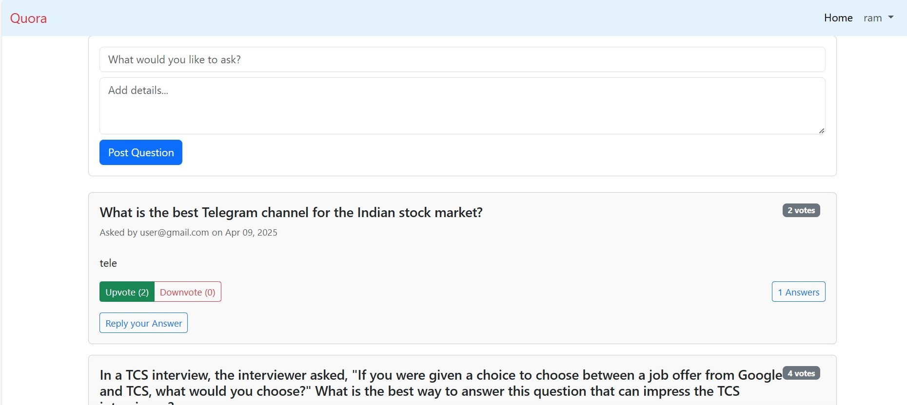

# Quora Clone - Django

A feature-rich Q&A platform inspired by Quora, built with Django.

- 
- 

## Features

- **User Authentication**
  - Email-based registration and login
  - logout

- **Question System**
  - Post, view , Edit, Delete
  - Rich text descriptions
  - Upvote/downvote questions
  - total upvotes count

- **Answer System**
  - Post answers to questions - view , Edit, Delete
  - Voting on answers
  - Answer on the Feed itslef or Question seperately

- **Community Features**
  - Responsive design

## Technologies Used

- **Backend**: Django 4.2
- **Frontend**: Bootstrap 5, HTML5, CSS3
- **Database**: SQLite (default)
- **Authentication**: Django Allauth

## Installation

### Prerequisites
- Python 3.11.3
- pip
- Virtualenv (recommended)

### Setup

1. Clone the repository:
   ```bash
   git clone https://github.com/balajisadanala/qoura_django
   cd quora-clone-django
